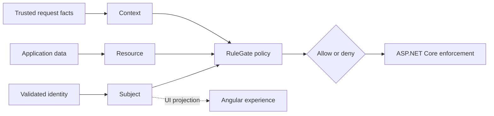

<p align="center">
  
</p>

<p align="center">
  <strong>Local-first, provider-independent authorization for .NET and Angular</strong>
</p>

<p align="center">
  Role-based authorization · Attribute-based authorization · Context-based authorization · Resource-based authorization · ASP.NET Core · Angular · YAML manifests · RuleGate CLI
</p>

<p align="center">
  <a href="https://github.com/fotbiler-lab/rulegate/actions/workflows/ci.yml"></a>
  <a href="https://www.nuget.org/packages/Fotbiler.RuleGate.AspNetCore"></a>
  <a href="https://www.nuget.org/profiles/fotbiler"></a>
  <a href="https://www.npmjs.com/package/@fotbiler/rulegate-angular"></a>
  <a href="https://www.npmjs.com/org/fotbiler"></a>
  <a href="https://dotnet.microsoft.com/"></a>
  <a href="https://angular.dev/"></a>
  <a href="LICENSE"></a>
</p>

<p align="center">
  <a href="docs/guide/README.md">Complete guide</a>
  ·
  <a href="docs/README.md">Documentation</a>
  ·
  <a href="#packages">Packages</a>
  ·
  <a href="#reference-applications">Samples</a>
  ·
  <a href="docs/roadmap.md">Roadmap</a>
  ·
  <a href="https://github.com/fotbiler-lab/rulegate/releases/latest">Latest release</a>
</p>

RuleGate answers one question inside your application:

> May this subject perform this action on this resource in the current
> context?

It combines permissions, roles, typed attributes, ownership, organization,
resource state, request context, MFA age, and time rules in one local,
fail-closed policy engine.



RuleGate performs authorization, not authentication. Your authentication
system validates the caller. RuleGate evaluates local policies against trusted
identity, application, resource, and request data.

## Why RuleGate?

- **Local-first:** decisions stay inside the application process.
- **Provider-independent:** use Keycloak or another identity provider without
  coupling the core policy model to it.
- **Composable:** combine RBAC, permissions, ABAC, CBAC, resources, time, and
  logical `all`, `any`, and `not` requirements.
- **Fail-closed:** missing policies, missing data, invalid types, provider
  failures, and indeterminate evaluation deny access.
- **Full-stack:** enforce in ASP.NET Core and project limited grants into
  modern Angular, legacy Angular, or a framework-independent TypeScript client.
- **Operational:** validate, test, explain, lint, and generate identifiers with
  the CLI; load and atomically reload local policy sources; observe safe logs
  and OpenTelemetry signals.

## Choose your path

| Goal                                             | Start here                                                                                                               |
| ------------------------------------------------ | ------------------------------------------------------------------------------------------------------------------------ |
| Protect an ASP.NET Core endpoint in five minutes | [Start in five minutes](#start-in-five-minutes)                                                                          |
| Move from built-in role or permission policies   | [ASP.NET Core migration path](docs/guide/05-ASP.NET-Core-Integration.md#migrate-from-built-in-aspnet-core-authorization) |
| Define policies in C# without YAML               | [Code-first policies without YAML](docs/guide/11-Policy-Sources-and-Reload.md#code-first-policies-without-yaml)          |

## A real policy

This policy requires a capability and role, checks document state,
organization, amount, separation of duties, network, device, MFA age, and
business hours:

```yaml
- id: document-approve
  resourceType: document
  action: approve
  requirement:
    all:
      - permission: DOC.APPROVE
      - role: DOCUMENT.APPROVER
      - attribute:
          source: resource
          name: status
          operator: equal
          valueType: string
          value: submitted
      - attributeComparison:
          left: { source: subject, name: organizationId }
          operator: equal
          right: { source: resource, name: organizationId }
      - attributeComparison:
          left: { source: resource, name: totalAmount }
          operator: lessThanOrEqual
          right: { source: subject, name: approvalLimit }
      - not:
          attributeComparison:
            left: { source: subject, name: userId }
            operator: equal
            right: { source: resource, name: ownerId }
      - context:
          property: networkZone
          operator: in
          valueType: stringCollection
          value: [internal, vpn]
      - contextAge:
          timestamp: mfa
          maximumAge: '00:15:00'
      - timeWindow:
          days: [monday, tuesday, wednesday, thursday, friday]
          start: '08:00'
          end: '18:00'
          timeZone: Europe/Istanbul
```

The host supplies every attribute from a trusted server-side source. The
browser cannot grant itself access.

## Packages

| Package                                                                                                | Purpose                                                   | Guide                                                           |
| ------------------------------------------------------------------------------------------------------ | --------------------------------------------------------- | --------------------------------------------------------------- |
| [`Fotbiler.RuleGate.Abstractions`](https://www.nuget.org/packages/Fotbiler.RuleGate.Abstractions)      | Public authorization and extension contracts              | [Packages](docs/guide/02-Packages-and-Installation.md)          |
| [`Fotbiler.RuleGate.Core`](https://www.nuget.org/packages/Fotbiler.RuleGate.Core)                      | Fail-closed engine and built-in evaluators                | [Foundations](docs/guide/01-Authorization-Foundations.md)       |
| [`Fotbiler.RuleGate.Manifest`](https://www.nuget.org/packages/Fotbiler.RuleGate.Manifest)              | YAML loading, validation, and compilation                 | [Policy language](docs/guide/04-Policy-Language.md)             |
| [`Fotbiler.RuleGate.AspNetCore`](https://www.nuget.org/packages/Fotbiler.RuleGate.AspNetCore)          | ASP.NET Core enforcement, mapping, and enrichment         | [ASP.NET Core](docs/guide/05-ASP.NET-Core-Integration.md)       |
| [`Fotbiler.RuleGate.Cli`](https://www.nuget.org/packages/Fotbiler.RuleGate.Cli)                        | Validation, testing, explanation, linting, and generation | [CLI lifecycle](docs/guide/09-CLI-and-Policy-Lifecycle.md)      |
| [`Fotbiler.RuleGate.Keycloak`](https://www.nuget.org/packages/Fotbiler.RuleGate.Keycloak)              | Optional Keycloak subject mapping                         | [Identity and Keycloak](docs/guide/07-Identity-and-Keycloak.md) |
| [`@fotbiler/rulegate-client`](https://www.npmjs.com/package/@fotbiler/rulegate-client)                 | Framework-independent frontend state                      | [Frontend](docs/guide/08-Frontend-Integration.md)               |
| [`@fotbiler/rulegate-angular`](https://www.npmjs.com/package/@fotbiler/rulegate-angular)               | Angular 20–22 guards, directives, and generation          | [Frontend](docs/guide/08-Frontend-Integration.md)               |
| [`@fotbiler/rulegate-angular-legacy`](https://www.npmjs.com/package/@fotbiler/rulegate-angular-legacy) | Angular 12–19 legacy adapter                              | [Frontend](docs/guide/08-Frontend-Integration.md)               |

## Start in five minutes

```bash
dotnet add package Fotbiler.RuleGate.AspNetCore --version 1.0.0
dotnet tool install Fotbiler.RuleGate.Cli --version 1.0.0 \
  --create-manifest-if-needed
dotnet tool run rulegate validate rulegate.yaml
```

Register a reloadable local manifest:

```csharp
builder.Services.AddAuthentication().AddJwtBearer();
builder.Services.AddAuthorization();

builder.Services
    .AddRuleGate()
    .AddHttpAuthorizationResultMapping()
    .AddYamlPolicyFile(
        "rulegate.yaml",
        options => options.ReloadOnChange = true);
```

Protect a Minimal API endpoint:

```csharp
app.MapGet("/documents/{id}", GetDocumentAsync)
    .RequireRuleGate("document", "read", "id");
```

Continue with the
[first protected API chapter](docs/guide/03-First-Protected-API.md), then follow
the [complete RuleGate guide](docs/guide/README.md) from foundations through
production deployment.

## Capabilities

| Area             | Included                                                                                                                                            |
| ---------------- | --------------------------------------------------------------------------------------------------------------------------------------------------- |
| Policy model     | permissions, roles, typed attributes, cross-attribute comparison, time/date windows, authentication/MFA age, canonical context, logical composition |
| ASP.NET Core     | dynamic policies, Minimal API helpers, MVC attributes, imperative authorization, trusted enrichment, safe HTTP results                              |
| Frontend         | framework-independent store, modern/legacy Angular guards and directives, Keycloak adapter, TypeScript generation                                   |
| Policy lifecycle | YAML, CLI validation/test/explain/lint, C#/TypeScript generation, file/embedded/config/custom sources, atomic reload                                |
| Operations       | safe diagnostics, OpenTelemetry activities/metrics, benchmarks, concurrency and package-consumer verification                                       |
| Security         | default deny, fail closed, bounded manifests/collections/depth, last-valid snapshot, non-sensitive public errors                                    |

## Reference applications and sample portfolio

- [Minimal ASP.NET Core](samples/aspnetcore-minimal/README.md) — compact
  package-only host with a comprehensive manifest and deterministic fixtures.
- [Document approval](samples/document-approval/README.md) — Keycloak,
  ASP.NET Core, SQLite, modern Angular, trusted providers, resource filtering,
  approval workflow, and verification scenarios.
- [Multi-domain and multi-stack sample portfolio](samples/README.md) — current
  applications, planned domains, platform baselines, authorization coverage,
  compatibility goals, and sample acceptance rules.

## Documentation

- [The RuleGate Guide](docs/guide/README.md) — connected beginner-to-advanced
  handbook with concepts, integrations, recipes, tests, and production review.
- [Documentation index](docs/README.md) — guide chapters and exhaustive
  references.
- [Security model](docs/security.md) — complete trust, failure, and privacy
  boundaries.
- [Roadmap](docs/roadmap.md) — released capabilities and planned work.
- [GitHub Wiki](https://github.com/fotbiler-lab/rulegate/wiki) — wiki edition
  generated from the canonical repository guide.

## Compatibility

- portable libraries: .NET Standard 2.0 and .NET 8–10;
- ASP.NET Core and Keycloak: .NET Core 3.1 and .NET 5–10;
- modern Angular: 20–22;
- legacy Angular adapter: 12–19;
- framework-independent client: Angular 9–11 and other TypeScript hosts.

See [platform compatibility](docs/platform-compatibility.md) for current and
legacy-tested support definitions.

## Security

Read the [security model](docs/security.md) before production integration.
Report vulnerabilities through the process in [SECURITY.md](SECURITY.md), not
through a public issue.

## Community and license

Contributions follow [CONTRIBUTING.md](CONTRIBUTING.md) and the
[Code of Conduct](CODE_OF_CONDUCT.md). Support guidance is in
[SUPPORT.md](SUPPORT.md).

RuleGate is licensed under the [MIT License](LICENSE).
