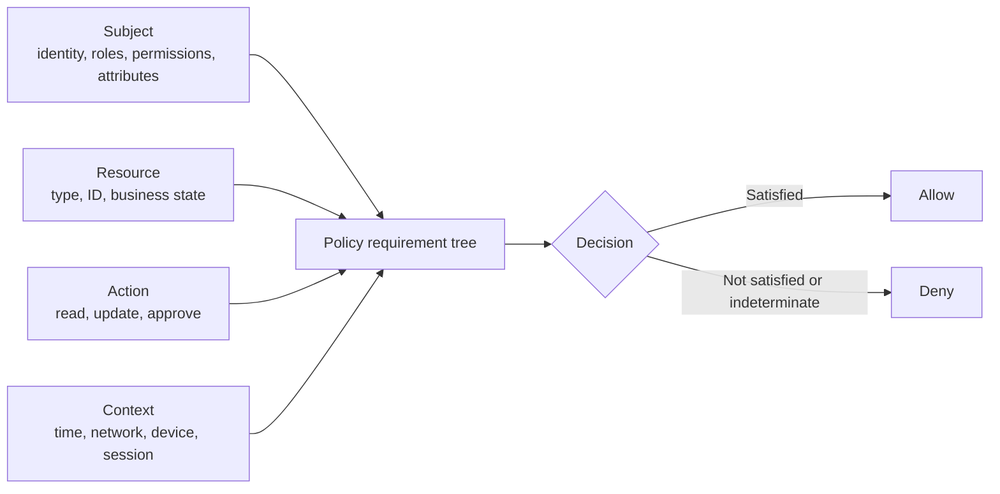
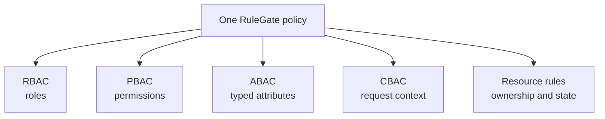

# 1. Authorization Foundations

Authorization answers a business question: **may this subject perform this
action on this resource under the current context?**

RuleGate represents that sentence directly:

```text
subject + resource + action + context -> policy -> allow or deny
```



Before writing code, learn what each part means and where its data should come
from.

## Authentication is not authorization

Authentication establishes who or what is calling. OpenID Connect, OAuth 2.0,
JWT bearer authentication, cookies, Keycloak, Microsoft Entra ID, Auth0, and a
custom identity service can all authenticate callers.

Authorization decides what an authenticated caller may do. A valid token does
not imply permission to approve an invoice, read another tenant's document, or
export confidential records.

RuleGate does not log users in, issue tokens, store passwords, or manage users.
It receives an authenticated `ClaimsPrincipal` or an explicitly constructed
subject and evaluates local policies. This separation keeps policies
provider-independent.

## The four inputs

### Subject

The subject is the authenticated actor:

```text
id: alice
roles: [DOCUMENT.APPROVER]
permissions: [DOC.READ, DOC.APPROVE]
attributes:
  organizationId: records
  clearanceLevel: 3
  approvalLimit: 50000
```

Subject data may include a stable identifier, roles, permissions, and trusted
application attributes. Claims can supply identity facts, while a subject
attribute provider can load current organization or clearance data from an
application service.

### Resource

The resource is the business object being protected:

```text
type: document
id: doc-1042
attributes:
  ownerId: alice
  organizationId: records
  classificationLevel: 2
  status: submitted
  totalAmount: 12000
```

A route identifier is not enough for resource-based authorization. The
backend must resolve that identifier to trusted domain data before RuleGate
can compare ownership, organization, status, or classification.

### Action

The action is a stable business verb such as `read`, `update`, `submit`,
`approve`, `reject`, `publish`, or `export`. Prefer domain language over HTTP
verbs. `approve` remains meaningful whether the operation is exposed by HTTP,
a queue consumer, or an application service.

### Context

Context describes trusted facts about this decision rather than durable facts
about the subject or resource:

```text
evaluationTime: 2026-08-01T09:30:00+03:00
attributes:
  networkZone: internal
  requestChannel: web
  trustedDevice: true
  authenticationTime: 2026-08-01T08:00:00+03:00
  multiFactorAuthenticationTime: 2026-08-01T09:25:00+03:00
```

Context should be derived by trusted server-side components. Never trust an
arbitrary `X-Network-Zone` header or a browser-provided `trustedDevice` flag.

## Authorization approaches

The common acronyms describe where a rule gets its evidence. RuleGate can use
them separately or compose them in one policy.



### RBAC: role-based access control

RBAC grants access because the subject has a role:

```yaml
requirement:
  role: DOCUMENT.APPROVER
```

Use roles for stable responsibilities such as auditor, approver, or
administrator. Avoid one role per individual document or tenant; that turns
the identity system into a copy of application state.

### PBAC: permission-based access control

PBAC grants access because the subject has a capability:

```yaml
requirement:
  permission: DOC.APPROVE
```

Permissions are often more precise than roles. A role may aggregate several
permissions, while policies still ask for the capability they need. RuleGate
does not expand roles into permissions; the identity/application mapping must
supply the effective values.

### ABAC: attribute-based access control

ABAC evaluates typed attributes:

```yaml
requirement:
  attributeComparison:
    left:
      source: subject
      name: clearanceLevel
    operator: greaterThanOrEqual
    right:
      source: resource
      name: classificationLevel
```

ABAC is a good fit for ownership, organization, department, classification,
limits, document status, employment type, labels, regions, and other domain
facts. Attribute values are typed; the number `3` is not the string `"3"`.

### CBAC: context-based access control

CBAC evaluates the circumstances of the request:

```yaml
requirement:
  all:
    - context:
        property: networkZone
        operator: in
        valueType: stringCollection
        value: [internal, vpn]
    - context:
        property: trustedDevice
        operator: equal
        valueType: boolean
        value: true
    - contextAge:
        timestamp: mfa
        maximumAge: '00:15:00'
```

Use context for request channel, trusted network classification, device trust,
tenant selection, authentication age, MFA age, and the evaluation clock.

### Resource-based authorization

Resource-based authorization evaluates the actual object, not only a global
claim:

```yaml
requirement:
  all:
    - attributeComparison:
        left: { source: subject, name: userId }
        operator: equal
        right: { source: resource, name: ownerId }
    - attribute:
        source: resource
        name: status
        operator: equal
        valueType: string
        value: draft
```

It is the difference between “Alice can update documents” and “Alice can
update this draft because she owns it.”

## Compose approaches instead of choosing one

A realistic approval policy can require all of the following:

1. `DOC.APPROVE` permission;
2. `DOCUMENT.APPROVER` role;
3. same organization as the document;
4. sufficient approval limit;
5. not the document owner;
6. submitted document state;
7. internal or VPN network;
8. trusted device;
9. MFA no older than 15 minutes;
10. weekday business hours.

This is PBAC + RBAC + ABAC + CBAC + resource-based authorization. The policy
is more expressive and easier to audit than a single giant role.

## Policy selection

RuleGate selects exactly one policy by the pair:

```text
resourceType + action
```

For example, `document/read` and `document/approve` are different routes.
Policy IDs are stable names used for diagnostics, tests, generated constants,
and frontend projections; the route is what the backend engine evaluates.

If no matching policy exists, RuleGate denies. Duplicate routes are rejected
during manifest validation.

## Requirements and logic

Requirements produce one of three internal outcomes:

- `Satisfied`: the requirement passed;
- `NotSatisfied`: trusted data was present and the rule did not match;
- `Indeterminate`: the rule could not be evaluated safely.

Policies combine requirements with:

- `all`: every child must be satisfied;
- `any`: at least one child must be satisfied;
- `not`: the child must be not satisfied.

An indeterminate result is never converted into an allow. This matters for
`not`: missing data does not become permission simply because the positive
rule could not be evaluated.

## Default deny and fail closed

RuleGate denies when:

- no policy matches;
- a requirement is not satisfied;
- a required attribute is missing;
- an attribute has an incompatible type;
- a provider cannot load trusted data;
- a policy source fails before the first valid snapshot;
- an evaluator or integration extension fails;
- manifest input is invalid;
- evaluation is cancelled.

This is the central security promise: uncertainty cannot silently become
access.

## Model data in the correct place

| Fact                       | Put it on               | Example                    |
| -------------------------- | ----------------------- | -------------------------- |
| Stable actor identity      | Subject                 | `id = alice`               |
| Actor capability           | Subject permission      | `DOC.READ`                 |
| Actor responsibility       | Subject role            | `DOCUMENT.APPROVER`        |
| Actor business assignment  | Subject attribute       | `organizationId = records` |
| Protected object state     | Resource attribute      | `status = submitted`       |
| Protected object ownership | Resource attribute      | `ownerId = alice`          |
| Request circumstance       | Context attribute       | `networkZone = internal`   |
| Decision time              | Context evaluation time | current trusted clock      |

Do not copy every token claim into attributes. Explicit mapping makes the
trust boundary reviewable.

## A useful design exercise

For every protected operation, complete this sentence:

> A **subject** may **action** this **resource** when **requirements**, using
> **trusted sources** for each fact.

Example:

> An authenticated approver may approve this submitted document when the user
> and document belong to the same organization, the amount is within the
> user's limit, the user is not the owner, the request comes from a trusted
> device on an internal network, and MFA is fresh. Identity facts come from a
> validated token; assignments and document facts come from application
> services; network and device facts come from the server trust evaluator.

If you cannot name the trusted source, the policy is not ready.

## Further reference

- [Complete authorization model](../authorization-model.md)
- [Security model](../security.md)
- [Glossary](Glossary.md)

---

Previous: [Guide home](README.md) · Next:
[Packages and installation](02-Packages-and-Installation.md)
