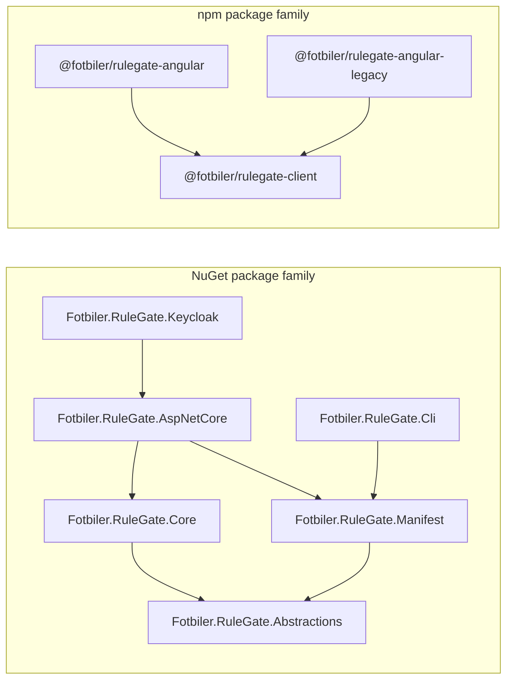

# 2. Packages and Installation

RuleGate is split into focused packages. Most applications should install the
host integration package rather than assembling the engine manually.



## Stable versions

This guide targets RuleGate `1.0.0`.

The six NuGet packages share one version. The three npm packages also share
one version. NuGet and npm families are versioned independently even when both
currently use `1.0.0`.

## NuGet package map

| Package                                                                                           | Install when                                                                | What it contains                                                                                             |
| ------------------------------------------------------------------------------------------------- | --------------------------------------------------------------------------- | ------------------------------------------------------------------------------------------------------------ |
| [`Fotbiler.RuleGate.Abstractions`](https://www.nuget.org/packages/Fotbiler.RuleGate.Abstractions) | Building an integration or extension that needs only contracts              | Subjects, resources, requests, decisions, policy definitions, source/reload contracts, diagnostics contracts |
| [`Fotbiler.RuleGate.Core`](https://www.nuget.org/packages/Fotbiler.RuleGate.Core)                 | Hosting RuleGate outside ASP.NET Core or constructing the engine directly   | Fail-closed engine, built-in evaluators, in-memory and atomic policy providers                               |
| [`Fotbiler.RuleGate.Manifest`](https://www.nuget.org/packages/Fotbiler.RuleGate.Manifest)         | Reading or compiling YAML outside the ASP.NET Core package graph            | YAML loader, validator, compiler, file and embedded-resource sources                                         |
| [`Fotbiler.RuleGate.AspNetCore`](https://www.nuget.org/packages/Fotbiler.RuleGate.AspNetCore)     | Building an ASP.NET Core API, MVC application, or service                   | DI registration, subject/resource mapping, endpoint metadata, enrichment, configuration source, HTTP results |
| [`Fotbiler.RuleGate.Cli`](https://www.nuget.org/packages/Fotbiler.RuleGate.Cli)                   | Validating, generating, testing, explaining, or linting policies            | `rulegate` .NET tool                                                                                         |
| [`Fotbiler.RuleGate.Keycloak`](https://www.nuget.org/packages/Fotbiler.RuleGate.Keycloak)         | Keycloak supplies realm/client roles and you want canonical mapping helpers | Optional Keycloak subject factory and role normalization                                                     |

Installing `Fotbiler.RuleGate.AspNetCore` brings the engine, abstractions, and
manifest dependencies required by the common host path:

```bash
dotnet add package Fotbiler.RuleGate.AspNetCore --version 1.0.0
```

Add Keycloak helpers only when needed:

```bash
dotnet add package Fotbiler.RuleGate.Keycloak --version 1.0.0
```

Install the CLI as a repository-local tool so CI and developers use the same
version:

```bash
dotnet new tool-manifest
dotnet tool install Fotbiler.RuleGate.Cli --version 1.0.0
dotnet tool run rulegate info
```

Global installation is convenient for exploration:

```bash
dotnet tool install --global Fotbiler.RuleGate.Cli --version 1.0.0
rulegate --version
```

## .NET compatibility

| Package group                | Target frameworks                                                            |
| ---------------------------- | ---------------------------------------------------------------------------- |
| Abstractions, Core, Manifest | `.NET Standard 2.0`, `.NET 8`, `.NET 9`, `.NET 10`                           |
| ASP.NET Core, Keycloak       | `.NET Core 3.1`, `.NET 5`, `.NET 6`, `.NET 7`, `.NET 8`, `.NET 9`, `.NET 10` |
| CLI                          | `.NET 8`, `.NET 9`, `.NET 10` tool assets                                    |

Read [platform compatibility](../platform-compatibility.md) for the tested
runtime matrix and support definitions.

## npm package map

| Package                                                                                                | Framework range       | Use it for                                                                                                 |
| ------------------------------------------------------------------------------------------------------ | --------------------- | ---------------------------------------------------------------------------------------------------------- |
| [`@fotbiler/rulegate-client`](https://www.npmjs.com/package/@fotbiler/rulegate-client)                 | Framework-independent | Fail-closed snapshot storage and permission, role, or policy checks                                        |
| [`@fotbiler/rulegate-angular`](https://www.npmjs.com/package/@fotbiler/rulegate-angular)               | Angular 20–22         | Signals client, functional guards, standalone directives, TypeScript generation, optional Keycloak adapter |
| [`@fotbiler/rulegate-angular-legacy`](https://www.npmjs.com/package/@fotbiler/rulegate-angular-legacy) | Angular 12–19         | Observable client, class guard, NgModule, and legacy directives                                            |

Angular 9–11 applications use the framework-independent client directly.

Modern Angular:

```bash
pnpm add @fotbiler/rulegate-angular@1.0.0
```

Legacy Angular:

```bash
pnpm add @fotbiler/rulegate-angular-legacy@1.0.0
```

Framework-independent client:

```bash
pnpm add @fotbiler/rulegate-client@1.0.0
```

Do not install modern and legacy Angular adapters into the same application.
They target different peer-dependency ranges.

## Choose by responsibility

Use this decision sequence:

1. **ASP.NET Core host?** Install `Fotbiler.RuleGate.AspNetCore`.
2. **Keycloak role mapping?** Also install `Fotbiler.RuleGate.Keycloak`.
3. **Worker, console, or custom host?** Use Abstractions + Core + Manifest.
4. **Policy work in local development or CI?** Install the CLI tool.
5. **Angular 20–22?** Install the modern Angular package.
6. **Angular 12–19?** Install the legacy Angular package.
7. **Angular 9–11 or another TypeScript framework?** Install the client.

## Copy the manifest to output

An ASP.NET Core application that loads `rulegate.yaml` from its content root
must publish the file:

```xml
<ItemGroup>
  <Content Include="rulegate.yaml">
    <CopyToOutputDirectory>PreserveNewest</CopyToOutputDirectory>
    <CopyToPublishDirectory>PreserveNewest</CopyToPublishDirectory>
  </Content>
</ItemGroup>
```

For immutable deployments, an embedded resource avoids a separate policy
file. For configuration-driven or reloadable policies, use the source options
in [Policy sources and reload](11-Policy-Sources-and-Reload.md).

## Keep versions synchronized

Within one ecosystem, do not mix RuleGate versions intentionally. A package
manager may select transitive dependencies that work, but aligned versions
make API, behavior, support, and incident investigation predictable.

```xml
<PackageReference Include="Fotbiler.RuleGate.AspNetCore" Version="1.0.0" />
<PackageReference Include="Fotbiler.RuleGate.Keycloak" Version="1.0.0" />
```

```json
{
  "dependencies": {
    "@fotbiler/rulegate-angular": "1.0.0"
  }
}
```

Commit lock files. Pin the CLI in a tool manifest. Upgrade packages and policy
tests together.

## Verify package origin

Use only the official package pages linked above. RuleGate stable NuGet and
npm packages contain repository metadata, MIT license metadata, README files,
and package-specific payloads. npm packages publish provenance; NuGet.org adds
its repository signature after acceptance.

## Further reference

- [Platform compatibility](../platform-compatibility.md)
- [Frontend compatibility](../frontend-compatibility.md)
- [Migrating to RuleGate 1.0](../migration-to-1.0.md)

---

Previous: [Authorization foundations](01-Authorization-Foundations.md) · Next:
[First protected API](03-First-Protected-API.md)
