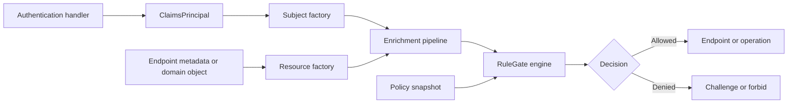

# 5. ASP.NET Core Integration

The ASP.NET Core package connects framework authentication and authorization
to RuleGate's provider-independent engine.



## Registration

For an immutable compiled manifest:

```csharp
var compilation = await new RuleGateManifestCompiler()
    .CompileFromFileAsync("rulegate.yaml");

if (!compilation.IsSuccess)
{
    throw new InvalidOperationException("Invalid RuleGate manifest.");
}

builder.Services.AddAuthentication().AddJwtBearer();
builder.Services.AddAuthorization();

builder.Services
    .AddRuleGate()
    .AddHttpAuthorizationResultMapping()
    .AddLoggingDiagnostics()
    .AddPolicies(compilation.Policies);
```

For a reloadable file source, replace `AddPolicies` with
`AddYamlPolicyFile`; see chapter 11.

## Subject mapping

The default subject factory maps:

- subject ID from `ClaimTypes.NameIdentifier`;
- roles from `ClaimTypes.Role`;
- permissions from the `permission` claim type.

Configure claim types when the validated token uses different names:

```csharp
builder.Services
    .AddRuleGate()
    .ConfigureSubjectMapping(options =>
    {
        options.SubjectIdClaimType = "sub";
        options.RoleClaimTypes.Clear();
        options.RoleClaimTypes.Add("role");
        options.PermissionClaimTypes.Clear();
        options.PermissionClaimTypes.Add("permissions");
    })
    .AddPolicies(compilation.Policies);
```

Claims do not automatically become subject attributes. Use explicit mapping or
trusted subject providers so the security boundary remains visible.

## Minimal API endpoints

Instance operation:

```csharp
app.MapGet("/documents/{id}", GetDocumentAsync)
    .RequireRuleGate(
        resourceType: "document",
        action: "read",
        resourceIdRouteValue: "id");
```

Collection operation:

```csharp
app.MapPost("/documents", CreateDocumentAsync)
    .RequireRuleGate(
        resourceType: "document",
        action: "create");
```

The optional route-value name supplies only the resource ID. It does not load
a domain entity or attributes.

## Controllers and actions

```csharp
using Fotbiler.RuleGate.AspNetCore.Authorization;
using Microsoft.AspNetCore.Mvc;

[ApiController]
[Route("api/documents")]
public sealed class DocumentsController : ControllerBase
{
    [HttpGet("{id}")]
    [RuleGateAuthorize(
        resourceType: "document",
        action: "read",
        resourceIdRouteValue: "id")]
    public IActionResult Get(string id)
    {
        return Ok(new { id });
    }
}
```

The attribute can be placed on a controller or action. Conflicting RuleGate
metadata fails closed.

## Imperative authorization after loading a resource

Endpoint metadata is useful before the handler runs. Imperative authorization
is useful when the domain object must be loaded first:

```csharp
public static async Task<IResult> UpdateAsync(
    string id,
    UpdateDocumentRequest request,
    ClaimsPrincipal user,
    IDocumentRepository documents,
    IAuthorizationService authorization,
    CancellationToken cancellationToken)
{
    var document = await documents.FindAsync(id, cancellationToken);

    if (document is null)
    {
        return Results.NotFound();
    }

    var resource = new AuthorizationResource(
        type: "document",
        id: document.Id,
        attributes: new AuthorizationAttributes(
        [
            new("ownerId", document.OwnerId),
            new("organizationId", document.OrganizationId),
            new("status", document.Status),
            new("classificationLevel", document.ClassificationLevel),
        ]));

    var result = await authorization.AuthorizeRuleGateAsync(
        user,
        resource,
        action: "update");

    if (!result.Succeeded)
    {
        return Results.Forbid();
    }

    await documents.UpdateAsync(document, request, cancellationToken);
    return Results.NoContent();
}
```

Do not perform the state change before authorization. Re-check authorization
within the same consistency boundary when resource facts can change between
read and write.

## Direct engine use

Workers, message consumers, and services can evaluate a fully constructed
request:

```csharp
var request = new AuthorizationRequest(
    subject: new AuthorizationSubject(
        id: "service-invoice-worker",
        roles: ["INVOICE.WORKER"],
        permissions: ["INVOICE.POST"],
        attributes: new AuthorizationAttributes(
        [
            new("organizationId", "finance"),
        ])),
    resource: new AuthorizationResource(
        type: "invoice",
        id: invoice.Id,
        attributes: new AuthorizationAttributes(
        [
            new("organizationId", invoice.OrganizationId),
            new("status", invoice.Status),
        ])),
    action: "post",
    context: new AuthorizationContext(
        evaluationTime: DateTimeOffset.UtcNow,
        attributes: new AuthorizationAttributes(
        [
            new("requestChannel", "worker"),
            new("identityType", "service"),
        ])));

var decision = await engine.EvaluateAsync(request, cancellationToken);

if (!decision.IsAllowed)
{
    // Stop the operation. Log only approved low-cardinality details.
}
```

In production ASP.NET Core code, prefer the injected `IRuleGateClock` or the
integration pipeline over calling `DateTimeOffset.UtcNow` directly when tests
or consistent host time semantics matter.

## Custom domain-object mapping

The default resource factory accepts `AuthorizationResource` and HTTP endpoint
metadata. To authorize arbitrary domain objects, implement
`IRuleGateAuthorizationResourceFactory` and register it before `AddRuleGate()`:

```csharp
builder.Services.AddSingleton<
    IRuleGateAuthorizationResourceFactory,
    ApplicationRuleGateResourceFactory>();

builder.Services.AddRuleGate();
```

The custom factory must preserve support for every framework resource the
application uses, including `HttpContext` if endpoint helpers remain enabled.
Return failure rather than inventing missing identifiers or attributes.

## HTTP result behavior

`AddHttpAuthorizationResultMapping()` supplies generic problem responses on
supported targets:

| Situation                      | HTTP behavior             |
| ------------------------------ | ------------------------- |
| No authenticated principal     | Challenge, normally `401` |
| Authenticated principal denied | Forbid, normally `403`    |
| Allowed                        | Endpoint executes         |

The public response does not expose policy IDs, requirement IDs, roles,
permissions, attributes, exception messages, or internal failure codes. Keep
internal diagnostics separate from client errors.

Applications with a custom `IAuthorizationMiddlewareResultHandler` keep their
custom handler. Review its output for information disclosure.

## Testing the integration

Test at four levels:

1. manifest tests for pure policy behavior;
2. subject/resource/context provider unit tests;
3. endpoint tests for `401`, `403`, and success;
4. domain tests that prove the protected state change does not occur on deny.

Include wrong casing, missing route IDs, missing attributes, provider failure,
cross-organization access, and stale resource state.

## Further reference

- [Complete ASP.NET Core reference](../aspnetcore.md)
- [Attribute enrichment](../enrichment.md)
- [Security model](../security.md)

---

Previous: [Policy language](04-Policy-Language.md) · Next:
[Trusted attributes and context](06-Trusted-Attributes-and-Context.md)
