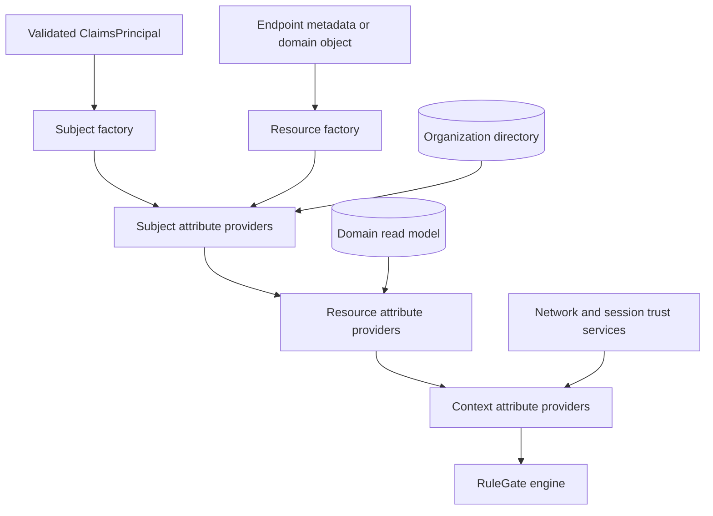

# 6. Trusted Attributes and Context

Policies are only as trustworthy as their inputs. ASP.NET Core enrichment lets
the application load current authorization data immediately before evaluation.



Providers run in fixed stage order: subject, resource, then context. Within a
stage they run sequentially by ascending `Order`.

## Provider contracts

Implement the contract for the target source:

- `IRuleGateSubjectAttributeProvider`
- `IRuleGateResourceAttributeProvider`
- `IRuleGateContextAttributeProvider`

Each exposes:

```csharp
int Order { get; }

RuleGateAttributeCollisionBehavior CollisionBehavior { get; }

ValueTask<RuleGateAttributeProviderResult> ProvideAttributesAsync(
    RuleGateAttributeProviderContext context,
    CancellationToken cancellationToken = default);
```

Default order is `0`; default collision behavior is `Fail`.

## Register providers

```csharp
builder.Services
    .AddRuleGate()
    .AddSubjectAttributeProvider<UserAssignmentProvider>()
    .AddResourceAttributeProvider<DocumentAttributesProvider>()
    .AddContextAttributeProvider<RequestTrustProvider>()
    .AddPolicies(compilation.Policies);
```

Providers are scoped by default and may safely depend on scoped repositories
or DbContexts. Stateless providers can use an explicit lifetime:

```csharp
.AddContextAttributeProvider<StaticChannelProvider>(
    ServiceLifetime.Singleton)
```

Never make a provider singleton when it depends on scoped services.

## Subject attributes from application data

This provider loads current organization, clearance, and approval limit. These
facts belong to the application directory rather than a long-lived token.

```csharp
using Fotbiler.RuleGate.Abstractions.Attributes;
using Fotbiler.RuleGate.AspNetCore.Enrichment;

public sealed class UserAssignmentProvider(
    IUserAuthorizationReader users)
    : IRuleGateSubjectAttributeProvider
{
    public int Order => 100;

    public async ValueTask<RuleGateAttributeProviderResult>
        ProvideAttributesAsync(
            RuleGateAttributeProviderContext context,
            CancellationToken cancellationToken = default)
    {
        var assignment = await users.FindAsync(
            context.Subject.Id,
            cancellationToken);

        if (assignment is null || !assignment.IsActive)
        {
            return RuleGateAttributeProviderResult.MissingRequiredData();
        }

        return RuleGateAttributeProviderResult.Success(
            new AuthorizationAttributes(
            [
                new("userId", context.Subject.Id),
                new("organizationId", assignment.OrganizationId),
                new("department", assignment.Department),
                new("clearanceLevel", assignment.ClearanceLevel),
                new("approvalLimit", assignment.ApprovalLimit),
                new("groups", assignment.Groups),
            ]));
    }
}
```

`MissingRequiredData()` denies and stops enrichment. It is correct when the
provider owns data needed for a safe decision.

## Resource attributes from the protected object

```csharp
public sealed class DocumentAttributesProvider(
    IDocumentAuthorizationReader documents)
    : IRuleGateResourceAttributeProvider
{
    public async ValueTask<RuleGateAttributeProviderResult>
        ProvideAttributesAsync(
            RuleGateAttributeProviderContext context,
            CancellationToken cancellationToken = default)
    {
        if (context.Resource.Id is null)
        {
            return RuleGateAttributeProviderResult.MissingRequiredData();
        }

        var document = await documents.FindAsync(
            context.Resource.Id,
            cancellationToken);

        if (document is null)
        {
            return RuleGateAttributeProviderResult.MissingRequiredData();
        }

        return RuleGateAttributeProviderResult.Success(
            new AuthorizationAttributes(
            [
                new("ownerId", document.OwnerId),
                new("organizationId", document.OrganizationId),
                new("classificationLevel", document.ClassificationLevel),
                new("status", document.Status),
                new("totalAmount", document.TotalAmount),
                new("labels", document.Labels),
            ]));
    }
}
```

The read model must enforce the same tenant/data-isolation rules as the
operation. Do not load a cross-tenant record and expect a later policy to fix a
repository leak.

## Context attributes from trusted request evaluation

```csharp
using Fotbiler.RuleGate.Abstractions.Authorization;

public sealed class RequestTrustProvider(
    IRequestTrustEvaluator trust,
    IOrganizationScheduleReader schedules)
    : IRuleGateContextAttributeProvider
{
    public async ValueTask<RuleGateAttributeProviderResult>
        ProvideAttributesAsync(
            RuleGateAttributeProviderContext context,
            CancellationToken cancellationToken = default)
    {
        var requestTrust = await trust.EvaluateAsync(
            context.HttpContext,
            cancellationToken);

        if (requestTrust is null)
        {
            return RuleGateAttributeProviderResult.MissingRequiredData();
        }

        var organizationId = context.Subject.Attributes
            .TryGetValue("organizationId", out var value)
                ? value as string
                : null;

        if (organizationId is null)
        {
            return RuleGateAttributeProviderResult.MissingRequiredData();
        }

        var schedule = await schedules.FindAsync(
            organizationId,
            cancellationToken);

        if (schedule is null)
        {
            return RuleGateAttributeProviderResult.MissingRequiredData();
        }

        return RuleGateAttributeProviderResult.Success(
            new AuthorizationAttributes(
            [
                new(
                    AuthorizationContextAttributeNames.RequestChannel,
                    requestTrust.Channel),
                new(
                    AuthorizationContextAttributeNames.NetworkZone,
                    requestTrust.NetworkZone),
                new(
                    AuthorizationContextAttributeNames.TrustedDevice,
                    requestTrust.IsTrustedDevice),
                new(
                    AuthorizationContextAttributeNames.OrganizationId,
                    organizationId),
                new("businessWindowStart", schedule.StartText),
                new("businessWindowEnd", schedule.EndText),
                new("businessTimeZone", schedule.TimeZoneId),
                new("riskScore", requestTrust.RiskScore),
            ]));
    }
}
```

This demonstrates organization-specific context loaded from application data.
`StartText` and `EndText` are application-normalized `HH:mm` strings and
`TimeZoneId` is a server-validated `TimeZoneInfo` identifier.
The built-in `timeWindow` has static manifest boundaries; when schedules vary
per organization, model the variable schedule as trusted context attributes
and a custom evaluator, or select organization-specific policies/snapshots.
Do not allow the browser to choose its own business hours.

## Canonical timestamps

MFA-age and authentication-age policies read canonical context names:

```csharp
new AuthorizationAttributes(
[
    new(
        AuthorizationContextAttributeNames.AuthenticationTime,
        validatedAuthenticationTime),
    new(
        AuthorizationContextAttributeNames.MultiFactorAuthenticationTime,
        validatedMfaTime),
])
```

Derive these from validated authentication/session evidence. A token's
authentication context must be validated and normalized before becoming an
authorization timestamp.

## Provider result behavior

| Result                  | Meaning                            | Pipeline behavior  |
| ----------------------- | ---------------------------------- | ------------------ |
| `Success(attributes)`   | Trusted attributes resolved        | Merge and continue |
| `Success()`             | Provider has nothing to add        | Continue           |
| `MissingRequiredData()` | Required trusted data absent       | Deny and stop      |
| `Fail()`                | Provider could not safely complete | Deny and stop      |

Exceptions, cancellation, unsupported values, invalid names, and collisions
also fail closed.

## Attribute types

Providers may return:

- `null`;
- strings;
- booleans;
- integer and decimal numbers;
- `DateTimeOffset`;
- homogeneous scalar collections with at most 256 items.

Dictionaries, nested collections, mixed-type collections, null collection
elements, and unsupported runtime objects are rejected.

## Collision behavior

| Behavior          | Use                                                   | Risk                                           |
| ----------------- | ----------------------------------------------------- | ---------------------------------------------- |
| `Fail`            | Default; duplicate names indicate ambiguous ownership | Safest and recommended                         |
| `KeepExisting`    | Earlier trusted source intentionally owns the value   | A later correction is ignored                  |
| `ReplaceExisting` | Later provider intentionally overrides                | Registration/order changes can alter decisions |

If you choose something other than `Fail`, document ownership of the key and
test provider ordering explicitly.

## Trust-source table

| Input                 | Good source                      | Unsafe shortcut             |
| --------------------- | -------------------------------- | --------------------------- |
| User organization     | Current application directory    | Unvalidated query parameter |
| Resource owner/status | Tenant-scoped domain repository  | Caller-posted DTO           |
| Network zone          | Trusted proxy/network classifier | Arbitrary header            |
| Trusted device        | Validated device/session service | Browser boolean             |
| MFA time              | Validated token/session evidence | Client clock                |
| Evaluation time       | Host `IRuleGateClock`            | Request value               |

## Test every provider

Cover success, missing data, exception, cancellation, invalid type, duplicate
key, cross-organization access, and exact precedence. Add an endpoint test to
prove the whole provider chain runs before evaluation.

## Further reference

- [Complete enrichment reference](../enrichment.md)
- [Context security](../security.md#context-trust-boundary)
- [Document approval sample](../../samples/document-approval/README.md)

---

Previous: [ASP.NET Core integration](05-ASP.NET-Core-Integration.md) · Next:
[Identity and Keycloak](07-Identity-and-Keycloak.md)
