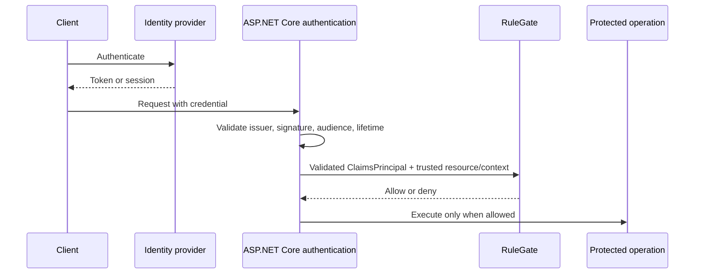

# 7. Identity and Keycloak

RuleGate is identity-provider independent. Authentication validates an
identity; RuleGate maps selected identity facts into a subject and evaluates
local policies.



## Integrate any identity provider

Configure the provider's normal ASP.NET Core authentication handler first.
Then configure RuleGate's claim mapping:

```csharp
builder.Services
    .AddAuthentication()
    .AddJwtBearer(options =>
    {
        options.Authority = configuration["Authentication:Authority"];
        options.Audience = configuration["Authentication:Audience"];
        options.MapInboundClaims = false;
    });

builder.Services.AddAuthorization();

builder.Services
    .AddRuleGate()
    .ConfigureSubjectMapping(options =>
    {
        options.SubjectIdClaimType = "sub";
        options.RoleClaimTypes.Clear();
        options.RoleClaimTypes.Add("roles");
        options.PermissionClaimTypes.Clear();
        options.PermissionClaimTypes.Add("permissions");
    });
```

Choose a stable, unique subject claim. Explicitly select role and permission
claim types. Do not map an entire token into attributes.

## What RuleGate does not validate

RuleGate does not validate token signatures, issuer, audience, expiration,
nonce, authentication flows, refresh tokens, or cookies. If authentication
accepts an untrusted principal, authorization receives untrusted identity
data. Treat authentication configuration as part of the authorization threat
model.

## Keycloak backend helper

Install:

```bash
dotnet add package Fotbiler.RuleGate.Keycloak --version 1.0.0
```

Configure validated JWT authentication and select the client roles RuleGate
may consume:

```csharp
using Fotbiler.RuleGate.AspNetCore.DependencyInjection;
using Fotbiler.RuleGate.Keycloak.DependencyInjection;

builder.Services
    .AddAuthentication()
    .AddJwtBearer(options =>
    {
        options.Authority = builder.Configuration["Keycloak:Authority"];
        options.Audience = builder.Configuration["Keycloak:Audience"];
        options.MapInboundClaims = false;
    });

builder.Services
    .AddRuleGate()
    .UseKeycloakSubjectMapping(options =>
    {
        options.ClientIds.Add("rulegate-api");
        options.PermissionClaimTypes.Add("app_permissions");
    });
```

The helper maps:

| Purpose               | Default claim                       |
| --------------------- | ----------------------------------- |
| Subject ID            | `sub`                               |
| Realm roles           | `realm_access.roles`                |
| Selected client roles | `resource_access.<client-id>.roles` |
| Explicit permissions  | `permission`                        |

Only configured client IDs are imported. You can disable realm roles or change
claim names through `RuleGateKeycloakSubjectOptions`.

## Canonical Keycloak role names

Realm and client roles use distinct namespaces:

```text
keycloak:realm:<encoded-role>
keycloak:client:<encoded-client-id>:<encoded-role>
```

Examples:

```text
keycloak:realm:administrator
keycloak:client:rulegate-api:documents.reader
keycloak:client:web%20portal:documents%2Fread
```

Use the canonical value in YAML:

```yaml
requirement:
  role: keycloak:client:rulegate-api:documents.reader
```

Keycloak places effective roles—including resolved composite descendants—in
the access token. RuleGate normalizes what the validated token contains; it
does not call the Keycloak Admin API or remotely expand composites.

## Keep business authorization local

Identity-provider roles are useful input, but domain rules still belong in
RuleGate:

```yaml
requirement:
  all:
    - role: keycloak:client:rulegate-api:documents.approver
    - permission: DOC.APPROVE
    - attributeComparison:
        left: { source: subject, name: organizationId }
        operator: equal
        right: { source: resource, name: organizationId }
    - not:
        attributeComparison:
          left: { source: subject, name: userId }
          operator: equal
          right: { source: resource, name: ownerId }
```

Keycloak authenticates and supplies effective identity roles. RuleGate decides
whether those facts plus current application data permit this operation.

## Keycloak Angular adapter

The modern Angular package exposes an optional secondary entrypoint without a
hard `keycloak-js` dependency:

```ts
import Keycloak from 'keycloak-js';
import { inject, Injectable } from '@angular/core';
import { RuleGateKeycloakAdapter } from '@fotbiler/rulegate-angular/keycloak';

@Injectable({ providedIn: 'root' })
export class ApplicationIdentityBridge {
  private readonly adapter = inject(RuleGateKeycloakAdapter);

  synchronize(keycloak: Keycloak): boolean {
    return this.adapter.synchronize(keycloak, {
      clientIds: ['rulegate-web'],
    });
  }

  clear(): void {
    this.adapter.clear();
  }
}
```

The host owns `keycloak.init`, login, token refresh, logout, and error
handling. Synchronize after successful initialization and every refresh. Clear
before identity changes, on logout, and after terminal authentication errors.

Use `createRuleGateSnapshotFromKeycloak` when composing the token projection
with backend-provided UI grants. If conversion returns `null`, clear the old
snapshot; never retain a previous user's grants.

## Frontend projection versus backend subject

They often share role and permission names but have different trust levels:

| Surface                         | Purpose                                           | Trust                                          |
| ------------------------------- | ------------------------------------------------- | ---------------------------------------------- |
| Backend validated token         | Build RuleGate subject                            | Security input after authentication validation |
| Backend application providers   | Add current assignments and resource/context data | Security input                                 |
| Frontend token/session          | Shape UI                                          | Untrusted by backend                           |
| Frontend authorization snapshot | Route/button experience                           | UI-only projection                             |

The API must re-evaluate the protected operation even when the Angular guard
already allowed navigation.

## Fail-closed cases

- missing or multiple distinct subject identifiers;
- malformed Keycloak structured claims;
- malformed role or permission arrays;
- unselected client roles;
- unauthenticated Angular session;
- failed snapshot conversion;
- exact role/permission casing mismatch.

All deny or clear grants.

## Further reference

- [Keycloak reference](../keycloak.md)
- [ASP.NET Core subject mapping](../aspnetcore.md#map-a-claimsprincipal)
- [Document approval Keycloak setup](../../samples/document-approval/keycloak/README.md)

---

Previous: [Trusted attributes and context](06-Trusted-Attributes-and-Context.md)
· Next: [Frontend integration](08-Frontend-Integration.md)
