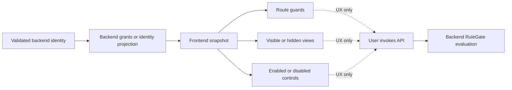

# 8. Frontend Integration

RuleGate frontend packages provide a fail-closed authorization projection for
user experience. They do not evaluate backend ABAC/CBAC/resource rules and
cannot secure an API.



## Snapshot model

All frontend packages use the same small projection:

```ts
interface RuleGateAuthorizationSnapshot {
  readonly permissions?: readonly string[];
  readonly policies?: readonly string[];
  readonly roles?: readonly string[];
}
```

It supports one exact permission, policy, or role check. Attribute, context,
time, ownership, and resource-state requirements remain backend-only.

## Framework-independent client

```bash
pnpm add @fotbiler/rulegate-client@1.0.0
```

```ts
import { RuleGateAuthorizationStore } from '@fotbiler/rulegate-client';

const authorization = new RuleGateAuthorizationStore();

const accepted = authorization.replaceSnapshot({
  permissions: ['DOC.READ'],
  policies: ['document-read'],
  roles: ['DOCUMENT.READER'],
});

if (!accepted) {
  throw new Error('Invalid frontend authorization projection.');
}

authorization.hasPermission('DOC.READ');
authorization.hasPolicy('document-read');
authorization.hasRole('DOCUMENT.READER');
authorization.isGranted({ permission: 'DOC.READ' });

authorization.clear();
```

Uninitialized state denies. Invalid, empty, or whitespace-padded identifiers
reject the complete snapshot and clear grants. Replacement is atomic: old
grants do not survive a new snapshot.

## Modern Angular 20–22

```bash
pnpm add @fotbiler/rulegate-angular@1.0.0
```

### Supply state

```ts
import { inject } from '@angular/core';
import { RuleGateAuthorizationClient } from '@fotbiler/rulegate-angular';

const authorization = inject(RuleGateAuthorizationClient);

authorization.replaceSnapshot({
  permissions: ['DOC.READ', 'DOC.APPROVE'],
  policies: ['document-read'],
  roles: ['DOCUMENT.APPROVER'],
});
```

Load the projection through application-owned bootstrap/session code. Clear it
before switching identities and during logout.

### Protect a route

```ts
import { Routes } from '@angular/router';
import { ruleGateGuard, ruleGateRouteData } from '@fotbiler/rulegate-angular';
import { RuleGateIdentifiers } from './generated/rulegate';

export const routes: Routes = [
  {
    path: 'documents',
    loadComponent: () =>
      import('./documents/documents.component').then((module) => module.DocumentsComponent),
    canActivate: [ruleGateGuard],
    data: ruleGateRouteData({
      permission: RuleGateIdentifiers.permissions.docRead,
    }),
  },
];
```

Configure denied navigation:

```ts
import { ApplicationConfig, inject } from '@angular/core';
import { RedirectCommand, Router } from '@angular/router';
import { provideRuleGateDeniedNavigation } from '@fotbiler/rulegate-angular';

export const appConfig: ApplicationConfig = {
  providers: [
    provideRuleGateDeniedNavigation(() => {
      const router = inject(Router);
      return new RedirectCommand(router.parseUrl('/forbidden'));
    }),
  ],
};
```

Direct factories are also available:

```ts
canActivate: [ruleGatePermissionGuard('DOC.READ')];
canActivate: [ruleGateRoleGuard('DOCUMENT.APPROVER')];
canActivate: [ruleGatePolicyGuard('document-read')];
```

Prefer declarative route data when reviewers should see the requirement next
to the route.

### Show or hide a view

```ts
import { Component } from '@angular/core';
import { RuleGateCanDirective } from '@fotbiler/rulegate-angular';

@Component({
  selector: 'app-document-actions',
  imports: [RuleGateCanDirective],
  template: `
    <button *ruleGateCan="{ permission: 'DOC.APPROVE' }; else approvalUnavailable" type="button">
      Approve
    </button>

    <ng-template #approvalUnavailable> Approval is unavailable for this session. </ng-template>
  `,
})
export class DocumentActionsComponent {}
```

### Keep a denied action visible but disabled

```ts
import { Component } from '@angular/core';
import { RuleGateDisableDirective } from '@fotbiler/rulegate-angular';

@Component({
  selector: 'app-export-action',
  imports: [RuleGateDisableDirective],
  template: `
    <button type="button" [ruleGateDisable]="{ permission: 'REPORT.EXPORT' }">Export</button>
  `,
})
export class ExportActionComponent {}
```

Native controls receive `disabled`. Custom interactive hosts also receive
`aria-disabled` and click blocking, but the application remains responsible
for correct focus and keyboard behavior.

## Generate TypeScript identifiers

```bash
pnpm exec rulegate-angular generate \
  ./rulegate.yaml \
  --output ./src/app/generated/rulegate.ts
```

Detect stale committed output in CI:

```bash
pnpm exec rulegate-angular generate \
  ./rulegate.yaml \
  --output ./src/app/generated/rulegate.ts \
  --check
```

Generation covers policies, permissions, roles, resource types, and actions.
It recognizes backend-only requirement kinds without pretending to grant
them. Run `rulegate validate` as the authoritative complete manifest check.

## Legacy Angular 12–19

```bash
pnpm add @fotbiler/rulegate-angular-legacy@1.0.0
```

Import `RuleGateLegacyModule`, then use the observable client, class guard, and
legacy directives:

```ts
@NgModule({
  imports: [RuleGateLegacyModule],
})
export class AuthorizationModule {}
```

```ts
const routes: Routes = [
  {
    path: 'documents',
    component: DocumentsComponent,
    canActivate: [RuleGateLegacyGuard],
    data: ruleGateLegacyRouteData({ permission: 'DOC.READ' }),
  },
];
```

```html
<button *ruleGateLegacyCan="{ permission: 'DOC.APPROVE' }">Approve</button>

<button [ruleGateLegacyDisable]="{ permission: 'REPORT.EXPORT' }">Export</button>
```

`RuleGateLegacyAuthorizationClient.snapshot$` provides observable state. The
underlying fail-closed store semantics are the same as the modern package.

## Angular 9–11

Use `@fotbiler/rulegate-client` inside a small application-owned Angular
service. Bind its results to the framework's existing guard and template
patterns. This keeps the stable authorization state independent of APIs not
available in those Angular versions.

## Snapshot source patterns

| Pattern                              | Use                                          | Rule                                                              |
| ------------------------------------ | -------------------------------------------- | ----------------------------------------------------------------- |
| Keycloak token adapter               | UI mirrors effective token roles/permissions | Clear on logout/refresh failure                                   |
| Backend `/me/authorization` endpoint | Backend calculates UI projection             | Treat response as UI state, not an authorization capability token |
| Hybrid composition                   | Token roles plus backend policy list         | Reject malformed parts and replace atomically                     |

Never cache one user's projection into another session. Consider expiry and
refresh semantics. A stale frontend can show the wrong button, but the backend
must still deny the operation.

## Further reference

- [Angular reference](../angular.md)
- [Frontend compatibility](../frontend-compatibility.md)
- [Keycloak integration](../keycloak.md)
- [Document approval web sample](../../samples/document-approval/web)

---

Previous: [Identity and Keycloak](07-Identity-and-Keycloak.md) · Next:
[CLI and policy lifecycle](09-CLI-and-Policy-Lifecycle.md)
