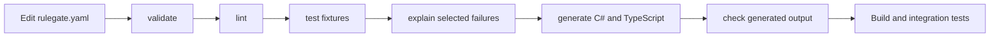

# 9. CLI and Policy Lifecycle

The RuleGate CLI turns policy work into a repeatable development and CI
workflow.



## Install locally

```bash
dotnet new tool-manifest
dotnet tool install Fotbiler.RuleGate.Cli --version 1.0.0
dotnet tool run rulegate info
```

The examples below use `rulegate` for readability. Replace it with
`dotnet tool run rulegate` for a local tool manifest.

## Validate syntax and semantics

```bash
rulegate validate
rulegate validate ./policies/rulegate.yaml
rulegate validate ./policies/rulegate.yaml --format json
```

Validation checks YAML loading, schema, policy IDs/routes, every requirement,
typed value/operator compatibility, logical structure, time/context rules, and
resource limits. Invalid input activates nothing.

Use JSON fields and exit codes in automation; do not parse human-readable
text.

## Generate C# identifiers

```bash
rulegate generate csharp \
  ./rulegate.yaml \
  --namespace DocumentService.Authorization \
  --output Generated/RuleGate.g.cs
```

Check committed output without modifying files:

```bash
rulegate generate csharp \
  ./rulegate.yaml \
  --namespace DocumentService.Authorization \
  --output Generated/RuleGate.g.cs \
  --check
```

Use generated identifiers instead of repeating strings in backend code.
Generation is deterministic, sorts identifiers, detects name collisions, and
writes atomically.

## Generate TypeScript identifiers

```bash
pnpm exec rulegate-angular generate \
  ./rulegate.yaml \
  --output ./src/app/generated/rulegate.ts
```

```bash
pnpm exec rulegate-angular generate \
  ./rulegate.yaml \
  --output ./src/app/generated/rulegate.ts \
  --check
```

C# and TypeScript generation reduce string drift. They do not authorize a
user and do not replace manifest validation.

## Test policy behavior without the application

Create `authorization.tests.yaml`:

```yaml
schemaVersion: 1
manifest: rulegate.yaml

tests:
  - id: reader-is-allowed
    request:
      subject:
        id: alice
        permissions: [DOC.READ]
      resource:
        type: document
        id: doc-1
      action: read
      context:
        evaluationTime: '2026-08-01T09:00:00+03:00'
    expect:
      outcome: allow

  - id: missing-permission-is-denied
    request:
      subject:
        id: bob
      resource:
        type: document
        id: doc-1
      action: read
      context:
        evaluationTime: '2026-08-01T09:00:00+03:00'
    expect:
      outcome: deny
      failureCodes:
        - RULEGATE_MISSING_PERMISSION
        - RULEGATE_MISSING_ROLE
```

Run:

```bash
rulegate test
rulegate test authorization.tests.yaml --filter organization
rulegate test authorization.tests.yaml --format json
```

Every test supplies explicit subject, resource, action, evaluation time, and
optional typed attributes. Fixed time keeps time/MFA tests deterministic.

Typed fixture attributes use entries:

```yaml
attributes:
  - name: organizationId
    valueType: string
    value: records
  - name: clearanceLevel
    valueType: number
    value: '4'
  - name: trustedDevice
    valueType: boolean
    value: 'true'
  - name: groups
    valueType: stringCollection
    values: [records, legal]
  - name: archivedAt
    valueType: nullValue
```

Add tests for allow, deny, indeterminate, no matching policy, exact casing,
missing data, wrong types, logical branches, boundary times, ownership,
organization, and context.

## Explain one decision safely

```bash
rulegate explain \
  authorization.tests.yaml \
  --test missing-permission-is-denied
```

JSON mode:

```bash
rulegate explain \
  authorization.tests.yaml \
  --test missing-permission-is-denied \
  --format json
```

Explanation uses the runtime evaluator and reports outcome, stable failure
codes, and the evaluated requirement tree. It omits subject/resource IDs,
roles, permissions, attribute values, policy literals, descriptions, random
IDs, and durations. Do not expose CLI explanations directly to untrusted HTTP
clients.

## Lint maintainability risks

```bash
rulegate lint rulegate.yaml
rulegate lint rulegate.yaml --format json
```

Lint detects duplicate or contradictory requirements, absorbed branches,
excessive depth/complexity, unnecessary logic, ID collisions, and risky
negative operators. Findings return exit code `1`, including warnings, so CI
can use a strict quality gate.

## Exit codes

|  Code | Meaning                                                                              |
| ----: | ------------------------------------------------------------------------------------ |
|   `0` | Command completed successfully                                                       |
|   `1` | Invalid input, failed expectation, lint finding, generation failure, or stale output |
|   `2` | Invalid command-line usage                                                           |
|   `3` | Unexpected internal failure                                                          |
| `130` | Cancelled                                                                            |

## CI example

```bash
set -euo pipefail

dotnet tool restore

dotnet tool run rulegate validate ./rulegate.yaml --format json
dotnet tool run rulegate lint ./rulegate.yaml --format json
dotnet tool run rulegate test ./authorization.tests.yaml --format json
dotnet tool run rulegate generate csharp \
  ./rulegate.yaml \
  --namespace DocumentService.Authorization \
  --output Generated/RuleGate.g.cs \
  --check

pnpm exec rulegate-angular generate \
  ./rulegate.yaml \
  --output ./web/src/app/generated/rulegate.ts \
  --check
```

Run policy gates before application builds so failures are focused and fast.

## Further reference

- [CLI reference](../cli.md)
- [Policy testing reference](../policy-testing.md)
- [Explain and lint reference](../explain-and-lint.md)
- [C# generation reference](../code-generation.md)

---

Previous: [Frontend integration](08-Frontend-Integration.md) · Next:
[Testing and diagnostics](10-Testing-and-Diagnostics.md)
