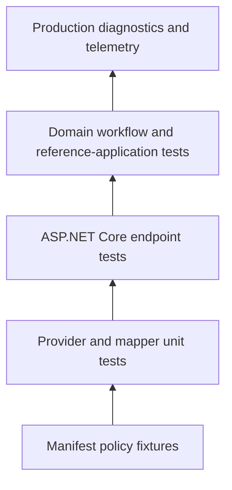

# 10. Testing and Diagnostics

Authorization tests must prove more than the happy path. A secure suite shows
that expected users succeed, forbidden users fail, incomplete data fails
closed, and integration failures do not change protected state.

## Test pyramid



| Layer                      | Proves                                                   | Does not prove                     |
| -------------------------- | -------------------------------------------------------- | ---------------------------------- |
| Policy fixture             | Pure policy outcome for explicit inputs                  | Host mapping and middleware        |
| Provider/factory unit test | Trusted data mapping and failure behavior                | Complete HTTP flow                 |
| Endpoint integration test  | Authentication + mapping + authorization + HTTP response | Every domain concurrency condition |
| Workflow test              | Unauthorized state changes cannot occur                  | Production configuration           |
| Diagnostics/telemetry      | Operational visibility and privacy contracts             | Business correctness by itself     |

## Policy test matrix

For each policy, include:

- one minimum allow case;
- one case for each denied requirement;
- missing policy route;
- missing required subject/resource/context attribute;
- wrong attribute type;
- wrong case for exact identifiers;
- relevant boundary values: equal limits, start/end time, MFA age;
- logical short-circuit and indeterminate cases;
- cross-organization and cross-tenant attempts;
- stale resource status;
- cancellation or provider failure at the host layer.

Example organization tests:

```yaml
tests:
  - id: same-organization-is-allowed
    request:
      subject:
        id: alice
        permissions: [DOC.READ]
        attributes:
          - name: organizationId
            valueType: string
            value: records
      resource:
        type: document
        id: doc-1
        attributes:
          - name: organizationId
            valueType: string
            value: records
      action: read
      context:
        evaluationTime: '2026-08-03T10:00:00+03:00'
    expect:
      outcome: allow

  - id: other-organization-is-denied
    request:
      subject:
        id: mallory
        permissions: [DOC.READ]
        attributes:
          - name: organizationId
            valueType: string
            value: legal
      resource:
        type: document
        id: doc-1
        attributes:
          - name: organizationId
            valueType: string
            value: records
      action: read
      context:
        evaluationTime: '2026-08-03T10:00:00+03:00'
    expect:
      outcome: deny
```

Use fixed explicit-offset times. Never let a policy test depend on the current
wall clock.

## Endpoint tests

An integration suite should assert:

| Scenario                   | Expected response                             | Expected state         |
| -------------------------- | --------------------------------------------- | ---------------------- |
| Anonymous                  | `401`                                         | unchanged              |
| Authenticated, not granted | `403`                                         | unchanged              |
| Missing required resource  | deny or application-safe `404` strategy       | unchanged              |
| Provider failure           | `403`/safe failure according to host boundary | unchanged              |
| Granted                    | success                                       | intended mutation only |

Avoid asserting internal failure codes in public HTTP bodies. Inspect internal
test diagnostics or engine decisions when exact reasons matter.

## Provider tests

For each provider, test:

```text
trusted success
missing required data
repository/service exception
cancellation
invalid attribute type
duplicate attribute key
wrong tenant/organization
selected collision behavior
provider order
```

Use a fake repository that records whether a cross-tenant query was attempted.
Authorization should not be used to hide an unsafe data-access pattern.

## Enable built-in logging diagnostics

Diagnostics are opt-in:

```csharp
builder.Services
    .AddRuleGate()
    .AddLoggingDiagnostics();
```

Configure the logging category in the normal ASP.NET Core logging system. The
built-in sink records bounded structural information such as decision outcome,
failure categories, requirement kinds, provider type, order, outcome, count,
and duration.

It intentionally omits subject/resource IDs, routes, role and permission
values, claims, attribute names/values in built-in telemetry, exception
messages, and stack traces where the safe contract excludes them.

## Diagnostics are not an audit log

Operational diagnostics answer “is the authorization system healthy?” An
audit log answers “who performed which business action?” Those are different
data models, retention policies, privacy controls, and integrity requirements.

Write domain audit events only after an operation is authorized and committed.
Do not turn RuleGate's safe diagnostics into a complete user activity log.

## Custom diagnostics sink

Implement `IAuthorizationDiagnosticsSink` for application-owned processing:

```csharp
public sealed class MetricsAuthorizationDiagnosticsSink
    : IAuthorizationDiagnosticsSink
{
    private readonly IApplicationMetrics _metrics;

    public MetricsAuthorizationDiagnosticsSink(IApplicationMetrics metrics)
    {
        _metrics = metrics;
    }

    public bool IsEnabled => true;

    public ValueTask WriteAsync(
        AuthorizationEvaluationDiagnostic diagnostic,
        CancellationToken cancellationToken = default)
    {
        _metrics.RecordAuthorization(
            allowed: diagnostic.IsAllowed,
            failureCategoryCount: diagnostic.FailureCodes.Count,
            duration: diagnostic.Duration);

        return ValueTask.CompletedTask;
    }
}
```

Register the sink according to the diagnostics reference. A sink must not
throw into the authorization path, leak sensitive values, perform unbounded
blocking work, or create high-cardinality metric labels.

## OpenTelemetry

RuleGate exposes standard .NET `ActivitySource` and `Meter` names through
`RuleGateTelemetry`. Register them in the host's OpenTelemetry configuration:

```csharp
services.AddOpenTelemetry()
    .WithTracing(tracing =>
        tracing.AddSource(RuleGateTelemetry.ActivitySourceName))
    .WithMetrics(metrics =>
        metrics.AddMeter(RuleGateTelemetry.MeterName));
```

The host selects exporters, resource attributes, sampling, and collector.
Built-in signals use low-cardinality categories and avoid authorization input
values. Do not add subject IDs, resource IDs, policy IDs, permissions, roles,
or attribute values as metric labels.

## Investigate a denial

Use this order:

1. confirm authentication produced the intended principal;
2. confirm exact policy route (`resourceType`, `action`);
3. run the equivalent fixture with `rulegate test`;
4. use `rulegate explain` on the fixture;
5. inspect safe provider and decision diagnostics;
6. verify trusted source data and types in a controlled environment;
7. reproduce through the endpoint integration test.

Do not “fix” an unexplained denial by adding an administrator bypass or
changing `all` to `any`.

## Further reference

- [Diagnostics reference](../diagnostics.md)
- [Policy testing reference](../policy-testing.md)
- [Telemetry, performance, and concurrency](../telemetry-performance-concurrency.md)
- [Security testing strategy](../security.md#security-testing-strategy)

---

Previous: [CLI and policy lifecycle](09-CLI-and-Policy-Lifecycle.md) · Next:
[Policy sources and reload](11-Policy-Sources-and-Reload.md)
