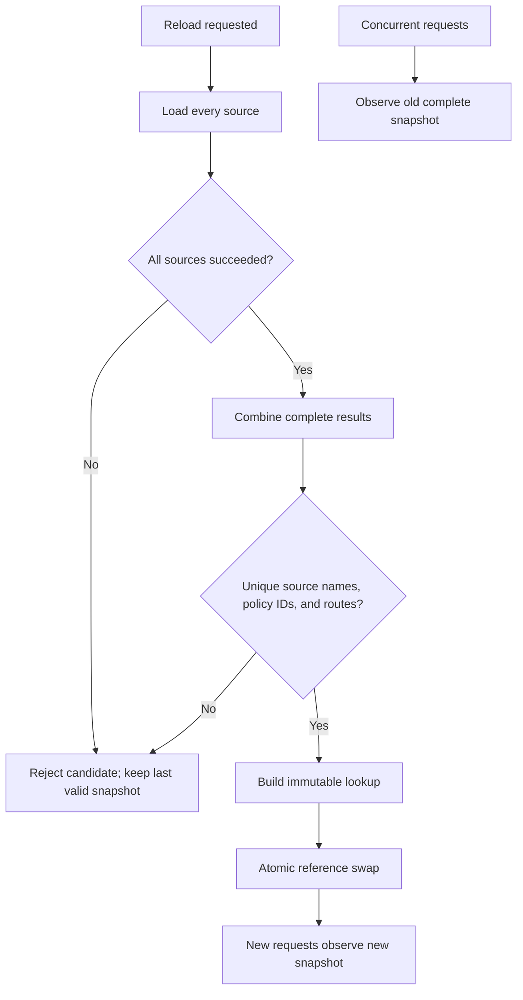

# 11. Policy Sources and Reload

RuleGate evaluates local immutable policy snapshots. Sources can be combined,
but a candidate becomes active only after every source succeeds and the
complete combined set is valid.

## Source selection

| Source                | Registration                   |   Automatic reload | Good fit                               |
| --------------------- | ------------------------------ | -----------------: | -------------------------------------- |
| In-memory definitions | `AddPolicy`, `AddPolicies`     |                 no | programmatic policies, tests           |
| YAML file             | `AddYamlPolicyFile`            |           optional | deployable local policy file           |
| Embedded YAML         | `AddEmbeddedPolicyResource`    |                 no | immutable policy inside assembly       |
| .NET configuration    | `AddConfigurationPolicySource` | provider-dependent | structured host configuration          |
| Application source    | `AddPolicySource`              |             manual | local application-owned transformation |

RuleGate does not require a database or remote authorization server. Custom
sources still load into the local process.

## Code-first policies without YAML

YAML is optional. Applications can construct policies directly in C# and do
not need the Manifest package or CLI for this path:

```csharp
using Fotbiler.RuleGate.Abstractions.Policies;
using Fotbiler.RuleGate.AspNetCore.DependencyInjection;

builder.Services
    .AddRuleGate()
    .AddPolicy(
        new PolicyDefinition(
            id: "invoice-approve",
            resourceType: "invoice",
            action: "approve",
            requirement: new AllRequirementDefinition(
            [
                new PermissionRequirementDefinition("INVOICE.APPROVE"),
                new RoleRequirementDefinition("FINANCE.APPROVER"),
            ])));
```

Use `AddPolicies` when definitions are assembled in an application module.
Code-first policies use the same engine, fail-closed behavior, diagnostics,
enrichment, and ASP.NET Core enforcement as compiled manifests. They are a
good fit when policies change only with application deployments or when an
existing code-based authorization system is being migrated incrementally.

YAML becomes useful when policies need independent review, CLI validation,
deterministic tests, identifier generation, or safe local reload. Choose the
source according to ownership and deployment needs; neither representation is
more trusted merely because of its format.

## Reloadable YAML file

```csharp
var manifestPath = Path.Combine(
    builder.Environment.ContentRootPath,
    "rulegate.yaml");

builder.Services
    .AddRuleGate()
    .AddYamlPolicyFile(
        manifestPath,
        options =>
        {
            options.ReloadOnChange = true;
        });
```

File changes are debounced. A missing, unreadable, malformed, invalid, or
conflicting candidate is rejected while the last valid snapshot remains
active.

## Embedded resource

```xml
<ItemGroup>
  <EmbeddedResource Include="Authorization/rulegate.yaml" />
</ItemGroup>
```

```csharp
builder.Services
    .AddRuleGate()
    .AddEmbeddedPolicyResource(
        typeof(Program).Assembly,
        "DocumentService.Authorization.rulegate.yaml");
```

This is useful for immutable artifacts and legacy deployment layouts that
cannot manage an external file safely.

## Configuration source

```json
{
  "RuleGate": {
    "SchemaVersion": 1,
    "Application": {
      "Id": "document-api",
      "Name": "Document API"
    },
    "Policies": [
      {
        "Id": "document-read",
        "ResourceType": "document",
        "Action": "read",
        "Requirement": {
          "Permission": "DOC.READ"
        }
      }
    ]
  }
}
```

```csharp
builder.Services
    .AddRuleGate()
    .AddConfigurationPolicySource(
        builder.Configuration,
        "RuleGate",
        options => options.ReloadOnChange = true);
```

Configuration providers decide whether reload notifications exist. Secrets
stores are not automatically policy stores; keep policy and secret concerns
separate.

## Application-defined source

```csharp
public sealed class ApplicationPolicySource : IPolicySource
{
    private readonly ILocalPolicyCatalog _catalog;

    public ApplicationPolicySource(ILocalPolicyCatalog catalog)
    {
        _catalog = catalog;
    }

    public string Name => "application";

    public async ValueTask<PolicySourceLoadResult> LoadAsync(
        CancellationToken cancellationToken = default)
    {
        var policies = await _catalog.LoadAsync(cancellationToken);
        return PolicySourceLoadResult.Success(policies);
    }
}
```

```csharp
builder.Services
    .AddRuleGate()
    .AddPolicySource<ApplicationPolicySource>();
```

Source names must be unique. Exceptions become stable diagnostics without
exposing messages or stack traces. Cancellation propagates.

## Manual reload

```csharp
var reloader = app.Services.GetRequiredService<IPolicyReloadService>();
var result = await reloader.ReloadAsync(cancellationToken);

if (!result.IsSuccess)
{
    foreach (var diagnostic in result.Diagnostics)
    {
        logger.LogError(
            "Policy source {Source} failed with {Code} at {Path}",
            diagnostic.SourceName,
            diagnostic.Code,
            diagnostic.Path);
    }
}
```

`CurrentSnapshot` contains operational metadata: local version, policy count,
and sorted source names. It does not expose manifest values or authorization
input. Local snapshot versions are not distributed generation IDs.

## Atomic activation



A reader never sees half a reload. Before the first valid activation, the
snapshot is empty and every lookup denies.

## Multi-instance operation

Each process reloads locally. For consistent fleet promotion:

1. validate, lint, and test the candidate in CI;
2. distribute the same versioned artifact/configuration;
3. restrict source write access;
4. observe reload success and active policy counts;
5. coordinate rollout/rollback through deployment tooling;
6. never use the in-process snapshot counter as a global version.

## Source security

- Treat source write access like application code deployment access.
- Never accept arbitrary user YAML as active production policy.
- Keep file permissions minimal.
- Bound custom source data and loading time.
- Return structured diagnostics rather than raw exceptions.
- Preserve the last valid snapshot on rejection.
- Test duplicate routes across sources.

## Further reference

- [Policy sources reference](../policy-sources.md)
- [Manifest security profile](../manifests.md#yaml-security-profile)
- [Concurrency contracts](../telemetry-performance-concurrency.md#thread-safety-contracts)

---

Previous: [Testing and diagnostics](10-Testing-and-Diagnostics.md) · Next:
[Extensibility](12-Extensibility.md)
